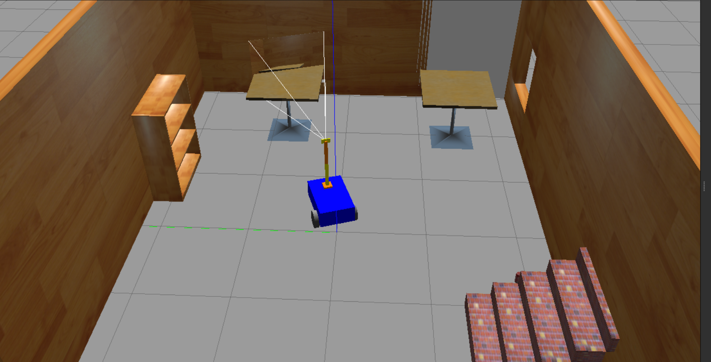
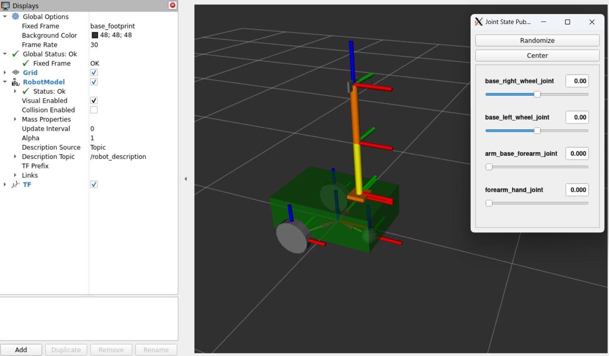
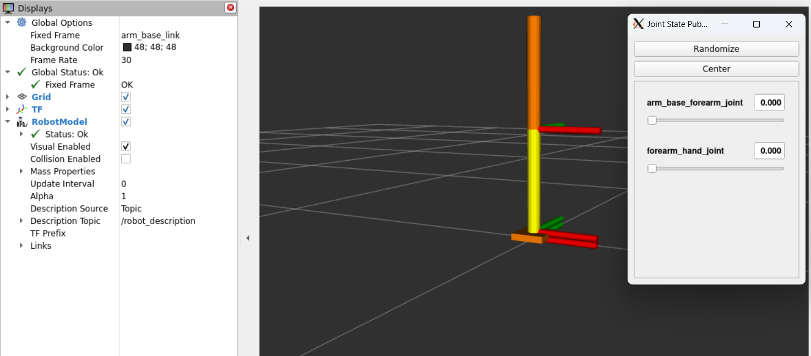
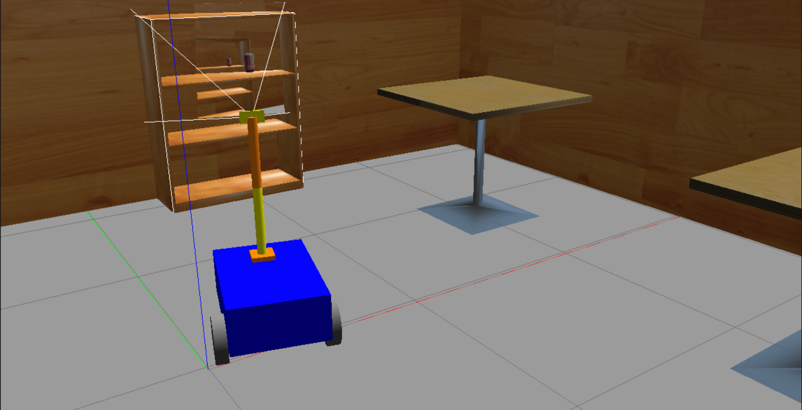

# Surveillance Robot

## Project Overview
The Surveillance Robot is a robotic system consisting of a 3D car model built in Gazebo with a 2-jointed serial manipulator mounted on top. The manipulator holds a camera at its tip. This project was developed using RViz2 and Gazebo for visualization and simulation.


## System Structure

### Car Model
The car model is created inside the `mobile_base.xacro` file. It is a classic 2-wheel Ackerman car. This file can be found inside the folder `src/my_robot_description`.

### Serial Manipulator
The 2-jointed serial manipulator is described inside the `arm.xacro` file, which is also in the `src/my_robot_description` folder. The manipulator has two cylindrical links and holds the camera at its tip.


### Camera
The camera is described in the `camera.xacro` file and is attached to the tip of the serial manipulator. This file is also found in the `src/my_robot_description` folder.

### Robot Assembly
The connection between the `arm.xacro` and `mobile_base.xacro` is made in the `my_robot.urdf.xacro` file.

### Visualization in RViz
To view the full robot in RViz, you can run:

```bash
ros2 launch my_robot_description display.launch.xml
```

To view only the arm in RViz, you can run:

```bash
ros2 launch my_robot_description display_2.launch.xml
```

### Gazebo World
A custom Gazebo world has been created with objects above the length of the car. The world file can be found in the directory `src/my_robot_bringup/worlds/`.


## Car Control

The car is controlled using the Gazebo plugin for the Ackerman car with a differential wheel controller. The configuration is inside the file `src/my_robot_description/mobile_base_gazebo.xacro`. The plugin used is `libgazebo_ros_diff_drive.so`.

Here is the configuration for the differential drive:

```xml
<gazebo>
    <plugin name="diff_drive_controller" filename="libgazebo_ros_diff_drive.so">
        <!-- Update rate in Hz -->
        <update_rate>50</update_rate>
        <!-- Wheels -->
        <left_joint>base_left_wheel_joint</left_joint>
        <right_joint>base_right_wheel_joint</right_joint>
        <!-- Kinematics -->
        <wheel_separation>0.45</wheel_separation> <!-- Distance between the center of one wheel to the other wheel -->
        <wheel_diameter>0.2</wheel_diameter>
        
        <!-- Output -->
        <publish_odom>true</publish_odom> <!-- Plugin is keeping track of the robot's position relative to the origin -->
        <publish_odom_tf>true</publish_odom_tf>
        <publish_wheel_tf>true</publish_wheel_tf>
        <odometry_topic>odom</odometry_topic>
        <odometry_frame>odom</odometry_frame>
        <robot_base_frame>base_footprint</robot_base_frame>
    </plugin>
</gazebo>
```
While the simulation is running, you can control the car by publishing a `geometry_msgs/msg/Twist message` to the `cmd_vel` topic, for example:
```bash
ros2 topic pub /cmd_vel geometry_msgs/msg/Twist "{linear: {x: 1.0, y: 0.0, z: 0.0}, angular: {x: 0.0, y: 0.0, z: 0.5}}"
```
## Arm Control

The arm is controlled using two Gazebo plugins: `gazebo_ros_joint_state_publisher.so` and `gazebo_ros_joint_pose_trajectory.so`.

### Joint State Publisher

The `gazebo_ros_joint_state_publisher` plugin allows the joint states of the arm to be published. The configuration for this plugin is as follows:
```xml
<gazebo>
    <plugin name="gazebo_ros_joint_state_publisher"
            filename="libgazebo_ros_joint_state_publisher.so">
        <!-- Update rate in Hertz -->
        <update_rate>10</update_rate>
        <!-- Name of joints in the model whose states will be published -->
        <joint_name>arm_base_forearm_joint</joint_name>
        <joint_name>forearm_hand_joint</joint_name>
    </plugin>
</gazebo>
```

This plugin publishes the states of the joints in the arm, allowing you to control the joint positions.

### Joint Pose Trajectory

The `gazebo_ros_joint_pose_trajectory` plugin allows you to control the joint positions with a trajectory. The configuration is as follows:

```xml
<gazebo>
    <plugin name="gazebo_ros_joint_pose_trajectory"
            filename="libgazebo_ros_joint_pose_trajectory.so">
        <!-- Update rate in Hz -->
        <update_rate>2</update_rate>
    </plugin>
</gazebo>
```

You can control the arm by publishing to the `/set_joint_trajectory` topic with a `trajectory_msgs/msg/JointTrajectory` message. For example:
```bash
ros2 topic pub -1 /set_joint_trajectory trajectory_msgs/msg/JointTrajectory '{header: {frame_id: arm_base_link}, joint_names: [arm_base_forearm_joint, forearm_hand_joint], points: [ {positions: {0.0, 0.0}} ]}'
```

## Running the Code
To run the entire simulation:
```bash
ros2 launch my_robot_bringup my_robot_gazebo.launch.xml
```

 
